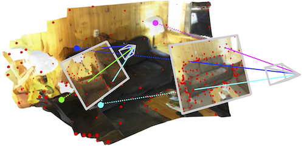

# COMO: Compact Mapping and Odometry

<h3 align="center"> <a href="https://edexheim.github.io/como/pdf/como.pdf">Paper</a> | <a href="https://edexheim.github.io/como/">Project Page</a> | <a href="https://youtu.be/9MxCQp-0vI0">Video</a> </h3>
<h3 align="center"> <a href="https://edexheim.github.io/">Eric Dexheimer</a> and <a href="https://www.doc.ic.ac.uk/~ajd/">Andrew J. Davison</a> </h3>

<p align="center">
  <a href="">
    
  </a>
</p>

COMO is a real-time monocular odometry and mapping system based on a compact 3D scene representation.

## Setup

In the base anaconda environment, run
```
source install.sh
```
which runs all the commands needed to create and activate a new environment, install dependencies, and build the backend.

## Datasets

We provide dataloaders for Replica, TUM, and ScanNet.  To run the single-threaded version of our system on TUM for example, call
```
python como/como_dataset.py --dataset_type=tum --dataset_dir=<path_to>/tum/rgbd_dataset_freiburg2_desk/
```
Specify the dataset type with `replica`, `tum`, `scannet`, and `realsense`.

We allow tracking and mapping to be configured for different devices, please see `config/como.yml`.  For example, tracking can be moved to `cpu` and mapping can be configured for `cuda:0`.

## Live Camera

We provide a dataloader for using the RGB stream from a RealSense camera.  Plug in the camera and run our multiprocessing version 

```
python como/como_demo.py --dataset_type=realsense
```

To intialize the system, it is usually best to provide a small translational motion until the geometry shows up on the GUI.

## Acknowledgements

We leverage the depth covariance function from [DepthCov](https://github.com/edexheim/DepthCov). 

We would also like to thank the authors of the following open-source repositories:
- [DeepFactors](https://github.com/jczarnowski/DeepFactors) for the custom OpenGL shaders.
- [MonoGS](https://github.com/muskie82/MonoGS) for how to integrate custom OpenGL shader into Open3D.


## Citation
If you found this code/work to be useful in your own research, please consider citing the following:
```bibtex
@article{dexheimer2024como,
  title={{COMO}: Compact Mapping and Odometry},
  author={Dexheimer, Eric and Davison, Andrew J.},
  journal={arXiv preprint arXiv:2404.03531},
  year={2024}
}

```

```bibtex
@inproceedings{dexheimer2023depthcov,
  title={Learning a Depth Covariance Function},
  author={Dexheimer, Eric and Davison, Andrew J.},
  booktitle={Proceedings of the IEEE/CVF Conference on Computer Vision and Pattern Recognition},
  pages={13122--13131},
  year={2023}
}
```
